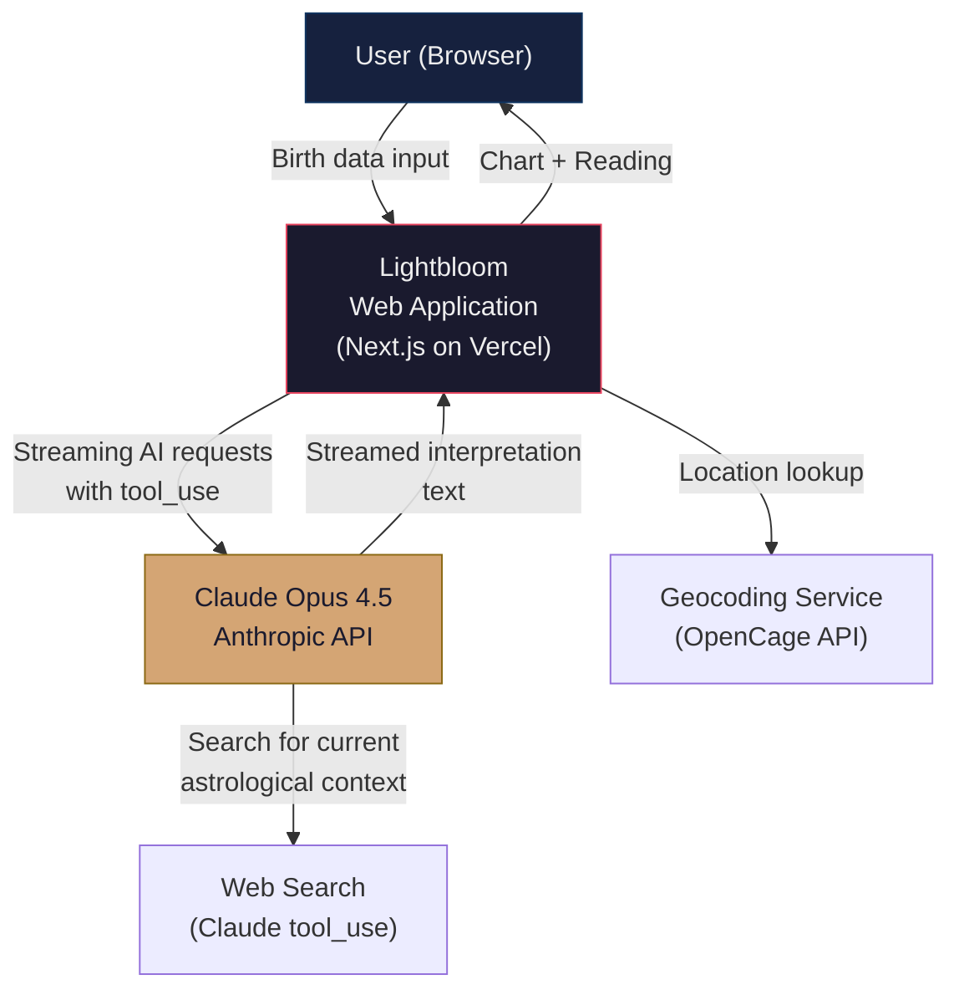
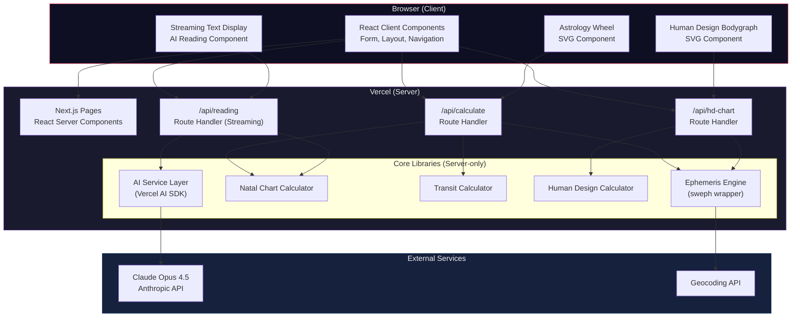

# Lightbloom -- Technical Architecture

**Version:** 1.0
**Date:** 2026-01-31
**Status:** Proposed
**Author:** System Architecture Design

---

## Table of Contents

1. [Executive Summary](#executive-summary)
2. [Business Context and Requirements](#business-context-and-requirements)
3. [Technology Evaluation](#technology-evaluation)
4. [Recommended Architecture](#recommended-architecture)
5. [Component Architecture](#component-architecture)
6. [Data Flow](#data-flow)
7. [Architecture Decision Records](#architecture-decision-records)
8. [Deployment Architecture](#deployment-architecture)
9. [Security Considerations](#security-considerations)
10. [Operational Concerns](#operational-concerns)

---

## 1. Executive Summary

Lightbloom is a web application that generates personalized astrology charts, 2026 transit readings, and Human Design reports powered by Claude Opus 4.5. The system takes a user's birth date, birth time, and birth location as inputs and produces three outputs: a natal chart with wheel visualization, a 2026 transit reading, and a Human Design bodygraph with an interpretive report.

The recommended architecture is a **Next.js 15+ monolith** deployed on **Vercel**, using **Tailwind CSS + shadcn/ui** for the interface, **custom SVG rendering** for both chart types, the **`sweph` npm package** for astronomical calculations, and the **Vercel AI SDK** with the Anthropic provider for streaming Claude Opus 4.5 responses.

This architecture optimizes for rapid development speed, deployment simplicity, excellent user experience through streaming, and a clean separation of concerns between calculation, visualization, and AI interpretation.

---

## 2. Business Context and Requirements

### Functional Requirements

| ID   | Requirement                                                      |
|------|------------------------------------------------------------------|
| FR-1 | Accept user input: birth date, birth time, birth location        |
| FR-2 | Calculate natal chart positions (planets, houses, aspects)       |
| FR-3 | Render SVG astrology wheel chart with zodiac signs and planets   |
| FR-4 | Calculate 2026 transits relative to natal positions              |
| FR-5 | Generate AI-powered 2026 transit reading via Claude Opus 4.5     |
| FR-6 | Calculate Human Design type, authority, profile, centers, gates  |
| FR-7 | Render SVG Human Design bodygraph (9 centers, channels, gates)   |
| FR-8 | Generate AI-powered Human Design interpretation report           |
| FR-9 | Support web search tool_use for current astrological context     |

### Non-Functional Requirements

| ID    | Requirement                | Target                                    |
|-------|----------------------------|-------------------------------------------|
| NFR-1 | Initial page load          | < 2 seconds (LCP)                         |
| NFR-2 | Chart calculation time     | < 500ms server-side                       |
| NFR-3 | AI response start          | < 2 seconds to first token (streaming)    |
| NFR-4 | Full reading generation    | < 60 seconds for complete output          |
| NFR-5 | Availability               | 99.5% uptime                              |
| NFR-6 | Responsiveness             | Mobile-first, works on all screen sizes   |
| NFR-7 | Accessibility              | WCAG 2.1 AA compliance                    |
| NFR-8 | SEO                        | Server-rendered landing and informational pages |

### Constraints

- **Budget:** Minimize infrastructure cost; prefer serverless/pay-per-use
- **Timeline:** MVP in 4-6 weeks
- **Team:** Small team (1-3 developers), strong in TypeScript/React
- **API costs:** Claude Opus 4.5 is premium; optimize token usage
- **Licensing:** `sweph` is AGPL-3.0 (server-side use is acceptable)

---

## 3. Technology Evaluation

### 3.1 Frontend Framework

| Criteria (Weight)              | Next.js 15+ App Router | Remix        | React + Vite  |
|--------------------------------|------------------------|--------------|---------------|
| SSR / SEO (20%)                | Excellent (10)         | Excellent (9)| None (2)      |
| API Routes / Backend (20%)     | Built-in (10)          | Loaders (8)  | Requires separate server (3) |
| Streaming Support (15%)        | Native RSC streaming (10) | Deferred loaders (8) | Manual (4) |
| Deployment Simplicity (15%)    | Vercel zero-config (10)| Vercel/Fly (7) | Manual config (5) |
| Ecosystem / Community (10%)    | Largest (10)           | Growing (7)  | Large (8)     |
| AI SDK Integration (10%)       | First-class Vercel AI SDK (10) | Manual (5) | Manual (5) |
| Learning Curve (10%)           | Moderate (7)           | Moderate (7) | Simple (9)    |
| **Weighted Score**             | **9.55**               | **7.45**     | **4.55**      |

**Recommendation: Next.js 15+ with App Router**

Next.js wins decisively due to its native streaming support for AI responses, built-in API routes that eliminate the need for a separate backend, first-class integration with the Vercel AI SDK for Claude, and zero-configuration deployment on Vercel. The App Router's React Server Components enable server-side chart calculations without shipping computation code to the client.

### 3.2 Styling

| Criteria (Weight)              | Tailwind + shadcn/ui   | Chakra UI    | Custom CSS    |
|--------------------------------|------------------------|--------------|---------------|
| Development Speed (25%)        | Excellent (10)         | Good (8)     | Slow (3)      |
| Design Quality (25%)           | Excellent (10)         | Good (8)     | Variable (5)  |
| Customizability (20%)          | Full ownership (10)    | Theme-based (7) | Total (10) |
| Bundle Size (15%)              | Minimal (10)           | Heavier (5)  | Minimal (10)  |
| Component Coverage (15%)       | 50+ components (9)     | 60+ components (10) | None (1) |
| **Weighted Score**             | **9.85**               | **7.55**     | **5.20**      |

**Recommendation: Tailwind CSS + shadcn/ui**

shadcn/ui provides beautiful, accessible components built on Radix UI primitives that you own (copied into your codebase, not an npm dependency). Combined with Tailwind CSS v4, this gives maximum design flexibility, excellent dark mode support, and components that are purpose-built for the Next.js App Router. The "mystic" aesthetic Lightbloom needs is easily achieved through Tailwind's customizable design tokens.

### 3.3 Chart Visualization

| Criteria (Weight)              | Custom SVG + React     | D3.js        | AstroChart lib | Canvas       |
|--------------------------------|------------------------|--------------|----------------|--------------|
| Astrology Wheel Quality (25%)  | Full control (9)       | Flexible (8) | Ready-made (7) | Possible (6) |
| Bodygraph Rendering (25%)      | Full control (9)       | Overkill (6) | N/A (0)        | Possible (6) |
| React Integration (20%)        | Native JSX (10)        | Ref-based (5)| DOM-based (4)  | Ref-based (5)|
| SSR Compatibility (15%)        | Works in RSC (10)      | Client-only (3) | Client-only (3) | Client-only (3) |
| Maintainability (15%)          | Type-safe (9)          | Complex (5)  | Limited (6)    | Complex (5)  |
| **Weighted Score**             | **9.40**               | **5.70**     | **4.15**       | **5.15**     |

**Recommendation: Custom SVG with React components**

Both the astrology wheel and Human Design bodygraph are fixed-structure diagrams (not data-driven visualizations that change shape). D3.js is powerful but introduces unnecessary complexity for charts with known geometry. Custom SVG components in React provide type safety, server-side rendering capability, direct animation via CSS/Framer Motion, and complete control over the visual design. The astrology wheel is a series of concentric arcs, lines, and positioned glyphs. The bodygraph is 9 positioned shapes connected by lines. Both are well-suited to hand-crafted SVG.

### 3.4 Backend / API Architecture

| Criteria (Weight)              | Next.js API Routes     | Separate Express/Fastify |
|--------------------------------|------------------------|--------------------------|
| Deployment Simplicity (25%)    | Single deploy (10)     | Two services (4)         |
| Streaming Support (20%)        | Native with AI SDK (10)| Manual SSE setup (6)     |
| Development Speed (20%)        | Colocated code (10)    | Separate repo/config (5) |
| Scalability (15%)              | Serverless auto-scale (9) | Manual scaling (7)    |
| Flexibility (10%)              | Constrained to Vercel (6) | Full control (10)     |
| Native Add-on Support (10%)   | Vercel supports (8)    | Full support (10)        |
| **Weighted Score**             | **9.15**               | **6.10**                 |

**Recommendation: Next.js API Routes (Route Handlers)**

For an MVP with a small team, the monolithic approach of Next.js API routes is significantly faster to develop and deploy. The Vercel AI SDK integrates natively with Route Handlers for streaming. The `sweph` native add-on works on Vercel's Node.js runtime. If the application outgrows this architecture, API routes can be extracted into a separate service later.

### 3.5 Astrology Calculation Engine

| Criteria (Weight)              | `sweph` (Node.js)      | `ephemeris` (pure JS) | External API   |
|--------------------------------|------------------------|-----------------------|----------------|
| Precision (30%)                | 0.001 arcsec (10)      | 0.1 arcsec (7)        | Variable (8)   |
| House Systems (20%)            | All major systems (10) | Limited (5)           | Variable (7)   |
| Performance (20%)              | Native C (10)          | JS interpreted (6)    | Network latency (4) |
| Ease of Integration (15%)     | N-API bindings (8)     | Pure import (10)      | HTTP calls (6) |
| HD Gate Calculations (15%)     | Full I Ching gates (10)| Not supported (2)     | Separate API (5) |
| **Weighted Score**             | **9.70**               | **5.85**              | **5.95**       |

**Recommendation: `sweph` (server-side)**

The `sweph` package by timotejroiko provides definitive Swiss Ephemeris bindings for Node.js with the highest precision available. It supports all house systems needed for astrology (Placidus, Whole Sign, Koch, etc.) and can calculate the precise planetary positions needed to derive Human Design gates (which map planetary longitudes to I Ching hexagrams). Server-side calculation keeps the native binary off the client and protects calculation logic.

### 3.6 Database

| Criteria (Weight)              | SQLite (Turso)         | PostgreSQL (Neon) | No Database    |
|--------------------------------|------------------------|--------------------|----------------|
| Simplicity (30%)               | Excellent (10)         | Moderate (7)       | Maximum (10)   |
| Report Storage (25%)           | Full support (9)       | Full support (10)  | None (0)       |
| Cost (20%)                     | Free tier generous (9) | Free tier (8)      | Zero (10)      |
| Scalability (15%)              | Edge-replicated (9)    | Centralized (8)    | N/A (0)        |
| MVP Speed (10%)                | Quick setup (8)        | Quick setup (7)    | Instant (10)   |
| **Weighted Score**             | **9.15**               | **7.90**           | **5.50**       |

**Recommendation: Start with no database, add Turso (SQLite) when needed**

For the MVP, reports can be generated on-demand and not persisted. The birth data and calculated positions can be encoded in the URL (via query parameters or a short hash) enabling shareable links without a database. When report storage or user accounts are needed, Turso (libSQL/SQLite at the edge) provides the lowest-friction upgrade path with Drizzle ORM.

### 3.7 Deployment

| Criteria (Weight)              | Vercel                 | Railway        | Self-hosted    |
|--------------------------------|------------------------|--------------  |----------------|
| Next.js Optimization (25%)     | Purpose-built (10)     | Generic (7)    | Manual (5)     |
| Streaming Support (20%)        | Native edge streaming (10) | Supported (8) | Manual (6)   |
| Native Add-ons (15%)           | Supported (8)          | Docker (10)    | Full (10)      |
| Cost at Low Scale (15%)        | Generous free tier (9) | $5/mo min (6)  | $5-20/mo (5)   |
| Operational Burden (15%)       | Zero-ops (10)          | Low (7)        | High (3)       |
| Scalability (10%)              | Auto-scale (10)        | Manual (7)     | Manual (5)     |
| **Weighted Score**             | **9.45**               | **7.35**       | **5.40**       |

**Recommendation: Vercel**

Vercel is purpose-built for Next.js and provides the best streaming support, automatic edge optimization, preview deployments for every PR, and a generous free tier. The AI SDK's streaming primitives are designed for Vercel's infrastructure. Native Node.js add-ons like `sweph` are supported on Vercel's Node.js (not Edge) runtime.

---

## 4. Recommended Architecture

### Architecture Style: Modular Monolith on Serverless

```
Architecture Pattern: Modular Monolith (Next.js)
Runtime: Vercel Serverless Functions (Node.js)
Rendering: React Server Components + Client Components (hybrid)
AI Integration: Vercel AI SDK v6 with Anthropic Provider
Calculations: Swiss Ephemeris via sweph (server-side only)
Visualization: Custom React SVG components
Styling: Tailwind CSS v4 + shadcn/ui
```

### Technology Stack Summary

| Layer              | Technology                              | Rationale                          |
|--------------------|-----------------------------------------|------------------------------------|
| Framework          | Next.js 15+ (App Router)               | SSR, API routes, streaming         |
| Language           | TypeScript 5.x                          | Type safety across the stack       |
| UI Components      | shadcn/ui + Radix UI                   | Accessible, beautiful, owned code  |
| Styling            | Tailwind CSS v4                         | Rapid, responsive, consistent      |
| Charts (Astro)     | Custom React SVG components             | Full control, SSR-compatible       |
| Charts (HD)        | Custom React SVG components             | Full control over bodygraph        |
| Ephemeris          | `sweph` v2.10.3+                        | Highest precision, full features   |
| AI Model           | Claude Opus 4.5 (`claude-opus-4-5-20251101`) | Best quality interpretation  |
| AI SDK             | Vercel AI SDK v6 + `@ai-sdk/anthropic`  | Streaming, tool_use, type-safe     |
| Animation          | Framer Motion                           | SVG animations, transitions        |
| Validation         | Zod                                     | Schema validation, form + API      |
| Geocoding          | OpenCage or Google Geocoding API        | Birth location to lat/long         |
| Deployment         | Vercel                                  | Zero-config, auto-scale            |
| Database (future)  | Turso + Drizzle ORM                     | Edge SQLite, when needed           |

---

## 5. Component Architecture

### 5.1 C4 Model -- System Context Diagram (Mermaid)



### 5.2 C4 Model -- Container Diagram (Mermaid)



### 5.3 Project Structure

```
lightbloom/
├── app/                              # Next.js App Router
│   ├── layout.tsx                    # Root layout (fonts, theme, metadata)
│   ├── page.tsx                      # Landing page (SSR)
│   ├── chart/
│   │   └── page.tsx                  # Main chart generation page
│   ├── reading/
│   │   └── page.tsx                  # AI reading display page
│   ├── about/
│   │   └── page.tsx                  # About/info page (SSR, SEO)
│   └── api/
│       ├── calculate/
│       │   └── route.ts              # Natal chart + transit calculation
│       ├── reading/
│       │   └── route.ts              # Streaming AI reading endpoint
│       ├── hd-calculate/
│       │   └── route.ts              # Human Design calculation
│       └── geocode/
│           └── route.ts              # Location geocoding proxy
│
├── components/
│   ├── ui/                           # shadcn/ui components
│   │   ├── button.tsx
│   │   ├── card.tsx
│   │   ├── input.tsx
│   │   ├── dialog.tsx
│   │   └── ...
│   ├── forms/
│   │   ├── birth-data-form.tsx       # Main input form
│   │   ├── date-picker.tsx           # Birth date selector
│   │   ├── time-picker.tsx           # Birth time selector
│   │   └── location-search.tsx       # Autocomplete location input
│   ├── charts/
│   │   ├── astrology/
│   │   │   ├── natal-wheel.tsx       # Main astrology wheel SVG
│   │   │   ├── zodiac-ring.tsx       # Outer zodiac sign ring
│   │   │   ├── house-ring.tsx        # House division ring
│   │   │   ├── planet-positions.tsx  # Planet glyphs positioned on wheel
│   │   │   ├── aspect-lines.tsx      # Aspect lines in center
│   │   │   ├── planet-glyph.tsx      # Individual planet SVG glyph
│   │   │   └── zodiac-glyph.tsx      # Individual zodiac sign SVG glyph
│   │   └── human-design/
│   │       ├── bodygraph.tsx         # Main bodygraph SVG
│   │       ├── center.tsx            # Individual center (defined/undefined)
│   │       ├── channel.tsx           # Channel connection line
│   │       ├── gate.tsx              # Gate indicator
│   │       └── bodygraph-layout.ts   # Position constants for all elements
│   ├── reading/
│   │   ├── streaming-text.tsx        # Streaming AI text display
│   │   ├── reading-section.tsx       # Section of a reading
│   │   └── transit-timeline.tsx      # Visual transit timeline
│   └── layout/
│       ├── header.tsx
│       ├── footer.tsx
│       └── theme-provider.tsx
│
├── lib/
│   ├── ephemeris/
│   │   ├── index.ts                  # Public API
│   │   ├── sweph-wrapper.ts          # sweph initialization and low-level calls
│   │   ├── planets.ts                # Planet position calculations
│   │   ├── houses.ts                 # House system calculations
│   │   └── aspects.ts                # Aspect calculations
│   ├── astrology/
│   │   ├── natal-chart.ts            # Natal chart assembly
│   │   ├── transits.ts               # Transit calculations for 2026
│   │   ├── zodiac.ts                 # Sign/degree utilities
│   │   └── types.ts                  # Astrology type definitions
│   ├── human-design/
│   │   ├── calculator.ts             # HD type/authority/profile calculation
│   │   ├── gates.ts                  # I Ching gate mapping from longitudes
│   │   ├── channels.ts               # Channel definitions (gate pairs)
│   │   ├── centers.ts                # Center definitions and activation logic
│   │   ├── types.ts                  # HD type definitions
│   │   └── constants.ts              # HD system constants
│   ├── ai/
│   │   ├── client.ts                 # AI SDK client setup
│   │   ├── prompts/
│   │   │   ├── natal-reading.ts      # System prompt for natal interpretation
│   │   │   ├── transit-reading.ts    # System prompt for 2026 transit reading
│   │   │   └── hd-reading.ts         # System prompt for HD interpretation
│   │   └── tools/
│   │       ├── web-search.ts         # Web search tool definition
│   │       └── ephemeris-lookup.ts   # Ephemeris lookup tool for AI
│   ├── geocoding/
│   │   └── index.ts                  # Geocoding service wrapper
│   ├── utils/
│   │   ├── date.ts                   # Date/time utilities
│   │   ├── math.ts                   # Trigonometry helpers for SVG
│   │   └── url.ts                    # URL parameter encoding
│   └── validators/
│       └── birth-data.ts             # Zod schemas for birth data
│
├── hooks/
│   ├── use-chart-calculation.ts      # Chart calculation hook
│   ├── use-streaming-reading.ts      # AI streaming hook
│   └── use-birth-form.ts             # Form state hook
│
├── styles/
│   ├── globals.css                   # Global styles + Tailwind directives
│   └── chart-theme.css               # CSS variables for chart colors
│
├── public/
│   └── fonts/                        # Custom typography
│
├── types/
│   ├── astrology.ts                  # Shared astrology types
│   ├── human-design.ts               # Shared HD types
│   └── api.ts                        # API request/response types
│
├── next.config.ts
├── tailwind.config.ts
├── tsconfig.json
└── package.json
```

### 5.4 SVG Chart Architecture

#### Astrology Wheel Structure

The natal chart wheel is composed of layered SVG groups:

```
<svg viewBox="0 0 800 800">        <!-- Responsive container -->
  <g id="zodiac-ring">              <!-- Outer ring: 12 zodiac signs -->
    <path ... />                     <!-- 30-degree arc per sign -->
    <ZodiacGlyph sign="aries" />    <!-- Sign symbols -->
  </g>
  <g id="degree-markers">           <!-- Degree tick marks -->
  </g>
  <g id="house-ring">               <!-- House divisions (Placidus) -->
    <line ... />                     <!-- House cusp lines -->
    <text>I</text>                   <!-- House numbers -->
  </g>
  <g id="planet-ring">              <!-- Planet positions -->
    <PlanetGlyph planet="sun" x={} y={} />
    <PlanetGlyph planet="moon" x={} y={} />
    <!-- ... all planets -->
  </g>
  <g id="aspect-web">               <!-- Center aspect lines -->
    <line class="trine" ... />       <!-- Color-coded by aspect type -->
    <line class="square" ... />
    <line class="opposition" ... />
  </g>
</svg>
```

Planet positions are calculated by converting ecliptic longitude to angular position on the wheel, with collision detection to prevent glyph overlap.

#### Human Design Bodygraph Structure

The bodygraph has a fixed layout of 9 centers connected by 36 channels:

```
<svg viewBox="0 0 400 600">        <!-- Portrait orientation -->
  <g id="channels">                 <!-- Render channels first (behind centers) -->
    <Channel from="throat" to="g" gates={[31,7]} defined={true} />
    <!-- ... all 36 channels -->
  </g>
  <g id="centers">                  <!-- 9 centers positioned absolutely -->
    <Center name="head"     x={200} y={40}  shape="triangle" defined={false} />
    <Center name="ajna"     x={200} y={120} shape="triangle" defined={true} />
    <Center name="throat"   x={200} y={210} shape="square"   defined={true} />
    <Center name="g"        x={200} y={300} shape="diamond"  defined={false} />
    <Center name="heart"    x={130} y={300} shape="triangle" defined={true} />
    <Center name="spleen"   x={80}  y={400} shape="triangle" defined={false} />
    <Center name="sacral"   x={200} y={420} shape="square"   defined={true} />
    <Center name="esp"      x={280} y={400} shape="triangle" defined={false} />
    <Center name="root"     x={200} y={520} shape="square"   defined={true} />
  </g>
  <g id="gates">                    <!-- Gate numbers on channels -->
    <Gate number={31} x={} y={} activated={true} color="personality" />
    <!-- ... all 64 gates -->
  </g>
</svg>
```

Centers are colored when "defined" (consistently energized) and white/open when "undefined." Channels connecting two activated gates become defined, which in turn defines the centers they connect.

---

## 6. Data Flow

### 6.1 Primary User Flow

```
Step 1: INPUT
User enters birth date, birth time, birth location
    |
    v
Step 2: GEOCODING (server)
/api/geocode converts location string to latitude/longitude/timezone
    |
    v
Step 3: CALCULATION (server, parallel)
/api/calculate and /api/hd-calculate run simultaneously:
    |
    ├── Natal Chart Calculation (sweph)
    │   ├── Convert birth datetime to Julian Day
    │   ├── Calculate planetary longitudes (Sun through Pluto + nodes)
    │   ├── Calculate house cusps (Placidus system)
    │   ├── Calculate aspects between planets
    │   └── Return: { planets, houses, aspects }
    │
    ├── 2026 Transit Calculation (sweph)
    │   ├── Calculate planetary positions for key 2026 dates
    │   ├── Calculate transit-to-natal aspects
    │   └── Return: { transits[] with dates and aspects }
    │
    └── Human Design Calculation (sweph + HD logic)
        ├── Calculate Personality (conscious) planet positions at birth
        ├── Calculate Design (unconscious) positions at ~88 days before birth
        ├── Map all planetary longitudes to I Ching gates (64 gates)
        ├── Determine activated channels (gate pairs)
        ├── Determine defined/undefined centers
        ├── Derive Type, Authority, Profile, Definition
        └── Return: { type, authority, profile, centers, channels, gates }
    |
    v
Step 4: RENDERING (client)
Browser receives calculation data and renders:
    ├── Astrology wheel SVG (natal chart)
    ├── Human Design bodygraph SVG
    └── Summary data tables
    |
    v
Step 5: AI INTERPRETATION (server -> client streaming)
/api/reading streams Claude Opus 4.5 response:
    ├── Send system prompt with astrology/HD context
    ├── Include calculated chart data as structured input
    ├── Enable web_search tool for current astrological context
    ├── Stream response tokens to client via SSE
    └── Client renders text progressively with typing effect
```

### 6.2 AI Reading API Flow (Detailed)

```
Client                    Next.js API Route          Claude Opus 4.5
  |                            |                           |
  |-- POST /api/reading ------>|                           |
  |   { chartData, type }      |                           |
  |                            |-- streamText() ---------->|
  |                            |   system: natal prompt     |
  |                            |   user: chart data         |
  |                            |   tools: [web_search]      |
  |                            |   maxTokens: 4096          |
  |                            |                           |
  |                            |<-- content_block_start ----|
  |<-- SSE: text delta --------|                           |
  |<-- SSE: text delta --------|<-- content_block_delta ----|
  |<-- SSE: text delta --------|<-- content_block_delta ----|
  |                            |                           |
  |                            |<-- tool_use: web_search ---|
  |                            |-- execute tool ----------->|
  |                            |-- tool_result ------------>|
  |                            |                           |
  |<-- SSE: text delta --------|<-- content_block_delta ----|
  |<-- SSE: text delta --------|<-- content_block_delta ----|
  |<-- SSE: done --------------|<-- message_stop -----------|
  |                            |                           |
```

### 6.3 Human Design Gate Calculation Flow

```
Birth DateTime
    |
    v
Calculate Julian Day Number
    |
    ├── Personality Sun Position (birth moment)
    │   longitude = sweph.calc(julday, SUN)
    │   gate = longitudeToGate(longitude)  // Map 360 degrees -> 64 gates
    │
    ├── Design Sun Position (~88 days before birth)
    │   designJulday = julday - 88.0
    │   longitude = sweph.calc(designJulday, SUN)
    │   gate = longitudeToGate(longitude)
    │
    └── ... repeat for Moon, Mercury, Venus, Mars,
        Jupiter, Saturn, Uranus, Neptune, Pluto,
        North Node, South Node (13 activations x 2 = 26 gate activations)
    |
    v
Collect all activated gates
    |
    v
Check channel definitions:
    For each of the 36 channels (defined by gate pairs):
        if (gate_A is activated AND gate_B is activated):
            channel is DEFINED
            both connected centers become DEFINED
    |
    v
Derive Type from defined centers:
    - Manifestor: Motor -> Throat (no Sacral definition)
    - Generator: Sacral defined (no Motor -> Throat)
    - Manifesting Generator: Sacral defined AND Motor -> Throat
    - Projector: No Sacral, no Motor -> Throat
    - Reflector: No centers defined
    |
    v
Derive Authority from highest defined authority center:
    Emotional > Sacral > Splenic > Heart/Ego > G/Self > Mental > None
```

---

## 7. Architecture Decision Records

### ADR-1: Use Next.js Monolith over Microservices

**Status:** Proposed

**Context:**
The application has three distinct capabilities (astrology calculation, Human Design calculation, AI interpretation) that could be deployed as separate services. The team is small (1-3 developers) and the timeline is 4-6 weeks for MVP.

**Decision:**
Implement as a Next.js monolith with clear module boundaries in the `/lib/` directory. API routes serve as the boundary between client and server. Internal libraries (ephemeris, astrology, human-design, ai) are separated by domain but share the same deployment unit.

**Consequences:**
- Easier: Single deployment, shared types, fast development, no inter-service communication overhead
- Harder: Cannot scale calculation and AI independently; cannot use different runtimes per capability
- Mitigation: Clear module boundaries allow future extraction. API routes already define the service interface.

**Alternatives Considered:**
1. **Separate Fastify microservice for calculations:** Adds deployment complexity, CORS configuration, and inter-service latency. Not justified for MVP scale.
2. **Serverless functions per capability:** Already achieved via Next.js Route Handlers, which are individually deployed serverless functions on Vercel.

---

### ADR-2: Custom SVG over D3.js or Charting Libraries

**Status:** Proposed

**Context:**
The application needs two chart types: an astrology natal wheel and a Human Design bodygraph. Both have fixed geometric structures (not data-driven shapes). Available libraries include D3.js, AstroChart (@astrodraw/astrochart), and Nocturna Wheel.

**Decision:**
Build both charts as custom React SVG components. Use React's declarative model to compose SVG elements. Use Framer Motion for entrance animations. Implement collision detection for planet glyph placement on the wheel.

**Consequences:**
- Easier: Full design control, type safety, SSR compatibility, no library overhead, consistent styling with the rest of the app, testable as React components
- Harder: More initial development time than using a library; must implement zodiac glyph SVG paths manually
- Mitigation: Zodiac and planet glyph SVG paths are well-documented and can be sourced from open icon sets. The geometric math for wheel layout is straightforward (polar-to-cartesian conversion).

**Alternatives Considered:**
1. **D3.js:** Powerful but DOM-centric; does not compose well with React's virtual DOM. Requires useRef and imperative code. Overkill for fixed-structure charts.
2. **AstroChart library:** Provides a natal wheel but is 2+ years stale, not typed for current TypeScript, and cannot render Human Design bodygraphs. Would still need custom SVG for half the visualization work.
3. **HTML Canvas:** Not accessible, not SEO-friendly, cannot be styled with CSS, poor print quality.

---

### ADR-3: Server-Side Ephemeris Calculations

**Status:** Proposed

**Context:**
Astrology and Human Design calculations require the Swiss Ephemeris engine. The `sweph` package is a native C add-on for Node.js. The `ephemeris` package is pure JavaScript but lower precision.

**Decision:**
Run all ephemeris calculations server-side using the `sweph` package in Next.js Route Handlers. Expose calculated results to the client as JSON via API responses.

**Consequences:**
- Easier: Highest precision, fastest calculation, protects calculation logic, `sweph` works natively in Node.js, no WASM bundling complexity
- Harder: Every chart requires a server round-trip; cannot work offline
- Mitigation: Calculation is fast (< 100ms). Results are deterministic and can be cached. Vercel serverless cold starts are minimal.

**Alternatives Considered:**
1. **Client-side with WASM Swiss Ephemeris:** Possible but adds 2-5MB to the client bundle, complex WASM build pipeline, and initialization overhead. Not worth it when server calculation takes < 100ms.
2. **Pure JavaScript ephemeris:** Lower precision (0.1 arcsec vs 0.001 arcsec) and does not support all house systems. Insufficient for professional-grade charts.

---

### ADR-4: Vercel AI SDK for Claude Integration

**Status:** Proposed

**Context:**
The application needs to stream Claude Opus 4.5 responses with tool_use (web search) support. Options include the raw Anthropic SDK, the Vercel AI SDK, or a custom SSE implementation.

**Decision:**
Use the Vercel AI SDK v6 with the `@ai-sdk/anthropic` provider. Use `streamText()` in Route Handlers and `useChat()` or a custom streaming hook on the client.

**Consequences:**
- Easier: Type-safe streaming, automatic SSE handling, built-in tool_use support with Zod schema validation, React hooks for client consumption, consistent with the Vercel deployment target
- Harder: Coupled to Vercel AI SDK abstractions; harder to use extended thinking or fine-grained control over raw API
- Mitigation: The AI SDK's Anthropic provider exposes model-specific options (thinking, effort). For edge cases, the raw Anthropic SDK can be used alongside.

**Alternatives Considered:**
1. **Raw Anthropic SDK with manual SSE:** Full control but requires writing streaming infrastructure, SSE formatting, client-side stream parsing, and tool execution loops manually. Significant development overhead.
2. **LangChain:** Heavy abstraction layer not needed for single-model, single-flow usage. Adds dependency weight without proportional value.

---

### ADR-5: No Database for MVP

**Status:** Proposed

**Context:**
The application generates reports based on birth data. Reports are deterministic given the same input (chart positions are astronomical facts; AI readings can vary but are regenerable). We need to decide whether to persist reports and/or user data.

**Decision:**
For MVP, do not use a database. Encode birth data parameters in URLs for shareability. Regenerate charts and readings on each visit. Plan for Turso (edge SQLite) addition when report saving or user accounts are needed.

**Consequences:**
- Easier: No database setup, no migrations, no connection management, no data privacy concerns, faster MVP delivery
- Harder: Cannot save reports; users must regenerate each visit; cannot track usage analytics at the application level; AI readings are not reproducible (different each time)
- Mitigation: URL-encoded parameters enable sharing and bookmarking. Chart calculations are deterministic and instant. AI readings are the expensive part (~$0.05-0.15 per reading) but acceptable for MVP without saving.

**Alternatives Considered:**
1. **Turso from day one:** Adds 1-2 days of setup but enables report persistence. Recommended for V1.1.
2. **Redis/KV cache:** Could cache AI readings by birth-data hash. Good intermediate step before a full database. Vercel KV is an option.

---

## 8. Deployment Architecture

### Vercel Deployment Configuration

```
Vercel Project
├── Framework: Next.js (auto-detected)
├── Node.js Runtime: 20.x (for sweph native add-on)
├── Build Command: next build
├── Output: .next/
│
├── Serverless Functions
│   ├── /api/calculate     -> Node.js runtime (uses sweph)
│   ├── /api/hd-calculate  -> Node.js runtime (uses sweph)
│   ├── /api/reading       -> Node.js runtime (streaming, 60s timeout)
│   └── /api/geocode       -> Edge runtime (proxy only)
│
├── Static Assets
│   ├── Landing page (ISR)
│   ├── About page (SSG)
│   └── Public assets (CDN-cached)
│
└── Environment Variables
    ├── ANTHROPIC_API_KEY
    ├── OPENCAGE_API_KEY (or GOOGLE_GEOCODING_KEY)
    └── NEXT_PUBLIC_APP_URL
```

### Function Configuration

```typescript
// next.config.ts
const nextConfig = {
  serverExternalPackages: ['sweph'],  // Native add-on, do not bundle
  experimental: {
    serverActions: {
      bodySizeLimit: '2mb',
    },
  },
};
```

```typescript
// app/api/reading/route.ts
export const maxDuration = 60;  // Allow 60s for AI streaming
export const runtime = 'nodejs'; // Required for streaming + sweph
```

---

## 9. Security Considerations

| Concern                  | Mitigation                                                    |
|--------------------------|---------------------------------------------------------------|
| API key exposure         | Store ANTHROPIC_API_KEY in Vercel env vars; never send to client |
| Input validation         | Zod schemas validate all birth data on server before processing |
| Prompt injection         | AI prompts are server-side only; user input is structured data, not free text injected into prompts |
| Rate limiting            | Vercel's built-in rate limiting + optional application-level limits |
| Geocoding abuse          | Proxy geocoding through server route; do not expose API key   |
| CORS                     | Default Next.js CORS (same-origin); no cross-origin API access |
| Cost control             | Set Anthropic API spend limits; monitor usage via dashboard    |

---

## 10. Operational Concerns

### Monitoring and Observability

- **Vercel Analytics:** Built-in web vitals, function duration, error rates
- **Vercel Logs:** Serverless function logs with search and filtering
- **Anthropic Dashboard:** Token usage, cost tracking, rate limit monitoring
- **Error Tracking:** Sentry integration for client and server errors (optional)

### Cost Estimation (Monthly, MVP Scale)

| Service                | Usage Assumption      | Estimated Cost |
|------------------------|-----------------------|----------------|
| Vercel (Hobby/Pro)     | < 100K function calls | $0 - $20       |
| Claude Opus 4.5 API    | 1000 readings/month   | $50 - $150     |
| Geocoding API           | 1000 lookups/month    | $0 - $5        |
| **Total**              |                       | **$50 - $175** |

### Performance Optimization Strategies

1. **Chart calculation caching:** Cache ephemeris results by birth-data hash (in-memory or Vercel KV)
2. **Streaming UX:** Show chart visualizations immediately while AI reading streams in
3. **Parallel calculations:** Run natal, transit, and HD calculations concurrently in the API route
4. **SVG optimization:** Use React.memo and key-based rendering to prevent unnecessary re-renders
5. **Font subsetting:** Only include used glyph characters for zodiac/planet symbol fonts
6. **Image optimization:** Use Next.js Image component for any raster assets

### Future Evolution Path

```
MVP (Now)                    V1.1 (Month 2)              V2 (Month 4+)
─────────────               ──────────────              ──────────────
No database          ->     Turso + Drizzle       ->    Full user accounts
URL-encoded params   ->     Saved reports         ->    Report history
Single reading type  ->     Multiple AI prompts   ->    Composite reports
No auth              ->     Optional auth         ->    Social sharing
Basic styling        ->     Polished animations   ->    PDF export
Web only             ->     PWA                   ->    Mobile app
```

---

## Appendix A: Key API Route Signatures

```typescript
// POST /api/calculate
// Request:
interface CalculateRequest {
  birthDate: string;        // ISO 8601 date
  birthTime: string;        // HH:MM format
  latitude: number;
  longitude: number;
  timezone: string;         // IANA timezone
  houseSystem?: string;     // Default: 'placidus'
}

// Response:
interface CalculateResponse {
  natal: {
    planets: PlanetPosition[];   // { planet, longitude, latitude, sign, degree, house, retrograde }
    houses: HouseCusp[];         // { house, longitude, sign, degree }
    aspects: Aspect[];           // { planet1, planet2, type, orb, applying }
    ascendant: number;
    midheaven: number;
  };
  transits2026: TransitEvent[];  // { date, transitPlanet, natalPlanet, aspectType, description }
}

// POST /api/hd-calculate
// Response:
interface HDCalculateResponse {
  type: 'Manifestor' | 'Generator' | 'Manifesting Generator' | 'Projector' | 'Reflector';
  authority: string;
  profile: string;            // e.g., "3/5"
  definition: string;         // e.g., "Single", "Split", "Triple Split", "Quadruple Split"
  centers: CenterState[];     // { name, defined: boolean }
  channels: ChannelState[];   // { gates: [number, number], defined: boolean, personality: boolean, design: boolean }
  gates: GateActivation[];    // { number, planet, line, personality: boolean, design: boolean }
  incarnationCross: string;
}

// POST /api/reading
// Request:
interface ReadingRequest {
  chartData: CalculateResponse | HDCalculateResponse;
  readingType: 'natal' | 'transit-2026' | 'human-design';
}
// Response: Streaming text (SSE via Vercel AI SDK)
```

---

## Appendix B: References and Resources

- [sweph - Swiss Ephemeris for Node.js](https://github.com/timotejroiko/sweph)
- [Vercel AI SDK - Anthropic Provider](https://ai-sdk.dev/providers/ai-sdk-providers/anthropic)
- [Claude API Streaming Documentation](https://platform.claude.com/docs/en/build-with-claude/streaming)
- [Claude Tool Use Implementation](https://platform.claude.com/docs/en/agents-and-tools/tool-use/implement-tool-use)
- [shadcn/ui - Next.js Installation](https://ui.shadcn.com/docs/installation/next)
- [HDKit - Human Design Toolkit](https://github.com/jdempcy/hdkit)
- [AstroChart - SVG Natal Charts](https://github.com/Kibo/AstroChart)
- [Nocturna Wheel - Astrology Chart Rendering](https://github.com/eaprelsky/nocturna-wheel)
- [Human Design API](https://www.humandesignapi.nl/)
- [AI SDK v6 Announcement](https://vercel.com/blog/ai-sdk-6)
